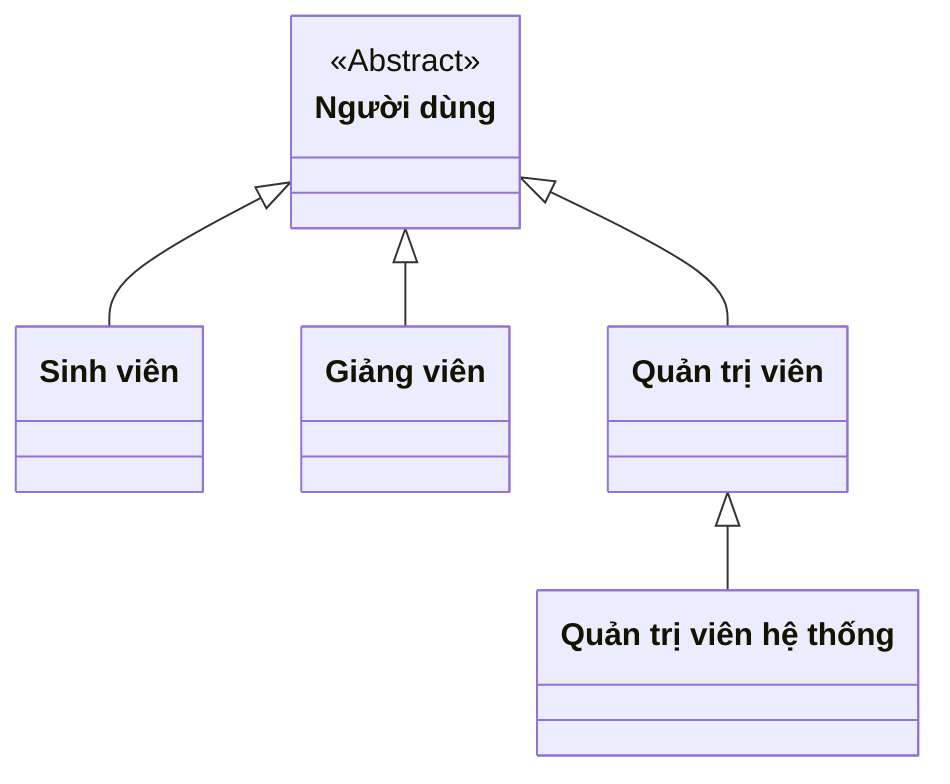
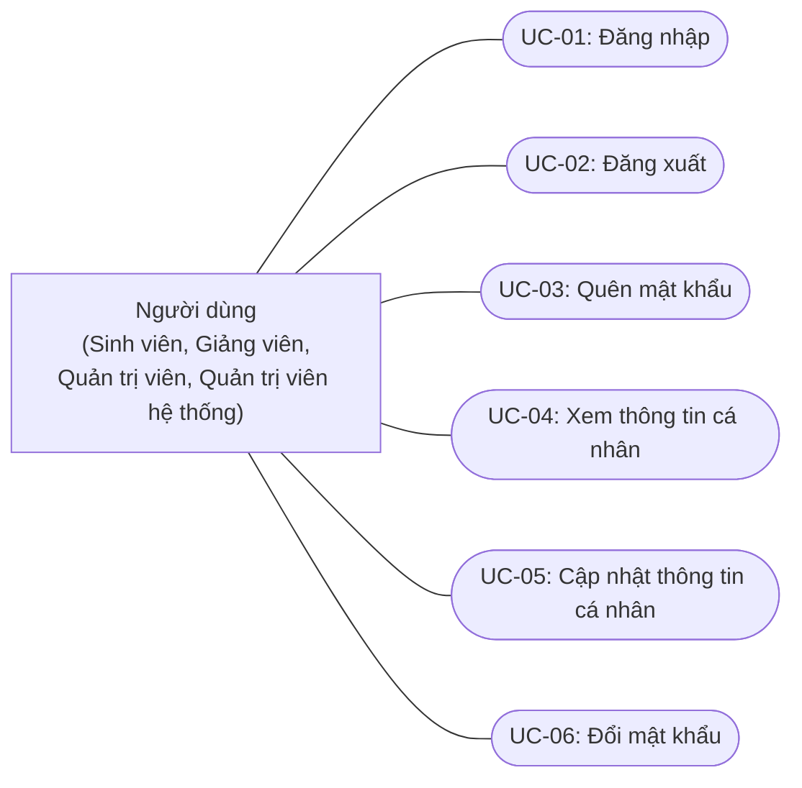
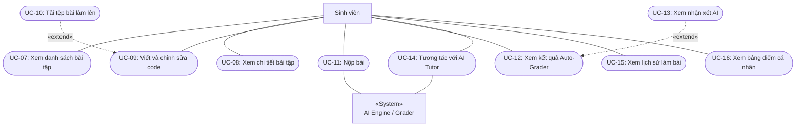
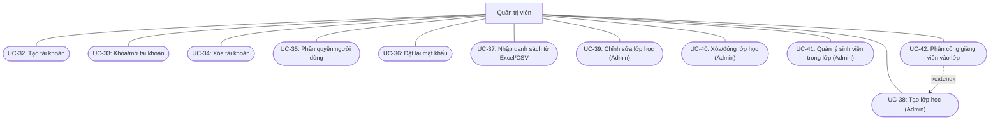

# SƠ ĐỒ USE CASE HỆ THỐNG AI CODING TUTOR (CHUẨN HÓA UML)

Tài liệu này cung cấp sơ đồ Use Case phân rã theo các phân hệ chức năng, được thiết kế theo đúng quy ước chuẩn **UML 2.5** nhằm khắc phục hoàn toàn các lỗi sai về chiều mũi tên `<<extend>>`, quan hệ `<<include>>`, và thiếu liên kết Actor.

---

## 1. Phân cấp Tác nhân (Actor Hierarchy)

Hệ thống AI Coding Tutor gồm 4 nhóm tác nhân chính với mối quan hệ kế thừa/phân quyền:

---

## 2. Sơ đồ Use Case Tổng quan & Phân hệ chung: Xác thực & Hồ sơ cá nhân

Áp dụng cho tất cả người dùng (**Sinh viên, Giảng viên, Quản trị viên, Quản trị viên hệ thống**).

---

## 3. Phân hệ Dành cho Sinh viên (Student Subsystem)

Gồm các chức năng làm bài, nộp bài, xem phản hồi AI và tương tác với AI Tutor.

> **Giải thích quy ước UML chuẩn:**
> - `UC-10 (Tải tệp bài làm lên)` mở rộng (`<<extend>>`) cho `UC-09 (Viết code)`: Sinh viên có thể tự gõ code trực tiếp trên web, hoặc tùy chọn tải file từ máy tính nạp vào editor.
> - `UC-13 (Xem nhận xét AI)` mở rộng (`<<extend>>`) cho `UC-12 (Xem kết quả Auto-Grader)`: Sinh viên xem kết quả kiểm thử test case, và có thể tùy chọn mở tab xem phân tích AI.
> - `UC-11 (Nộp bài)` và `UC-12 (Xem kết quả)` là các Use Case độc lập có liên kết trực tiếp với Sinh viên (sinh viên có thể nộp bài xong rời đi, rồi quay lại xem kết quả sau).

---

## 4. Phân hệ Dành cho Giảng viên (Teacher Subsystem)

Gồm quản lý lớp học, ngân hàng bài tập, cấu hình chấm tự động và chấm bài thủ công.

```mermaid
flowchart TB
    %% Actors
    Teacher["Giảng viên"]

    %% Lớp học
    UC17(["UC-17: Tạo lớp học"])
    UC18(["UC-18: Chỉnh sửa lớp học"])
    UC19(["UC-19: Xóa/đóng lớp học"])
    UC20(["UC-20: Quản lý sinh viên trong lớp"])

    %% Bài tập
    UC21(["UC-21: Tạo bài tập"])
    UC22(["UC-22: Chỉnh sửa bài tập"])
    UC23(["UC-23: Xóa bài tập"])
    UC24(["UC-24: Thiết lập hạn nộp bài"])
    UC25(["UC-25: Thiết lập test case"])
    UC26(["UC-26: Thiết lập rubric"])
    UC27(["UC-27: Giao bài tập cho lớp"])

    %% Đánh giá & Chấm bài
    UC28(["UC-28: Xem danh sách bài nộp"])
    UC29(["UC-29: Xem điểm"])
    UC30(["UC-30: Xem AI đánh giá"])
    UC31(["UC-31: Đánh giá/chấm bài thủ công"])

    %% Associations
    Teacher --- UC17
    Teacher --- UC18
    Teacher --- UC19
    Teacher --- UC20
    Teacher --- UC21
    Teacher --- UC22
    Teacher --- UC23
    Teacher --- UC24
    Teacher --- UC25
    Teacher --- UC26
    Teacher --- UC27
    Teacher --- UC28
    Teacher --- UC29
    Teacher --- UC31

    %% Relationships
    UC30 -. "«extend»" .-> UC28
    UC31 -. "«include»" .-> UC28
```

> **Giải thích quy ước UML chuẩn:**
> - `UC-31 (Đánh giá/chấm bài thủ công)` bắt buộc bao gồm (`<<include>>`) `UC-28 (Xem bài nộp)`: Để chấm thủ công một bài làm, giảng viên phải mở bài nộp của sinh viên đó.
> - `UC-30 (Xem AI đánh giá)` là hành động mở rộng tùy chọn (`<<extend>>`) khi xem chi tiết bài nộp (`UC-28`).
> - `UC-24 (Hạn nộp)`, `UC-25 (Test case)`, `UC-26 (Rubric)` có thể được thực hiện độc lập từ ngân hàng đề hoặc khi quản lý bài tập.

---

## 5. Phân hệ Dành cho Quản trị viên (Admin Subsystem)

Quản lý người dùng, phân quyền RBAC và quản lý lớp học toàn trường.

> **Giải thích quy ước UML chuẩn:**
> - `UC-42 (Phân công giảng viên)` có thể được thực hiện độc lập, hoặc mở rộng (`<<extend>>`) trực tiếp ngay trong bước tạo lớp mới (`UC-38`).

---

## 6. Phân hệ Dành cho Quản trị viên hệ thống (Super Admin Subsystem)

Quản trị cấu hình AI, hạ tầng Docker Sandbox cách ly, quản lý tổ chức Multi-tenant và System Logs.

---

## 7. Toàn cảnh mã nguồn PlantUML (Dành cho việc render ra ảnh PNG/SVG/PDF)

Nếu bạn cần render ảnh chất lượng cao trên draw.io, PlantText hoặc các IDE plugin, bạn có thể sử dụng trực tiếp mã PlantUML dưới đây:

```plantuml
@startuml AI_Coding_Tutor_UseCases
left to right direction
skinparam packageStyle rectangle
skinparam shadowing false
skinparam monochrome false

actor "Người dùng" as User <<Abstract>>
actor "Sinh viên" as Student
actor "Giảng viên" as Teacher
actor "Quản trị viên" as Admin
actor "Quản trị viên hệ thống" as SuperAdmin

User <|-- Student
User <|-- Teacher
User <|-- Admin
Admin <|-- SuperAdmin

rectangle "Hệ thống AI Coding Tutor" {
  ' Common
  package "Xác thực & Hồ sơ" {
    usecase "UC-01: Đăng nhập" as UC01
    usecase "UC-02: Đăng xuất" as UC02
    usecase "UC-03: Quên mật khẩu" as UC03
    usecase "UC-04: Xem thông tin cá nhân" as UC04
    usecase "UC-05: Cập nhật thông tin cá nhân" as UC05
    usecase "UC-06: Đổi mật khẩu" as UC06
  }

  ' Student
  package "Phân hệ Sinh viên" {
    usecase "UC-07: Xem danh sách bài tập" as UC07
    usecase "UC-08: Xem chi tiết bài tập" as UC08
    usecase "UC-09: Viết và chỉnh sửa code" as UC09
    usecase "UC-10: Tải tệp bài làm lên" as UC10
    usecase "UC-11: Nộp bài" as UC11
    usecase "UC-12: Xem kết quả Auto-Grader" as UC12
    usecase "UC-13: Xem nhận xét AI" as UC13
    usecase "UC-14: Tương tác với AI Tutor" as UC14
    usecase "UC-15: Xem lịch sử làm bài" as UC15
    usecase "UC-16: Xem bảng điểm cá nhân" as UC16
  }

  ' Teacher
  package "Phân hệ Giảng viên" {
    usecase "UC-17: Tạo lớp học" as UC17
    usecase "UC-18: Chỉnh sửa lớp học" as UC18
    usecase "UC-19: Xóa/đóng lớp học" as UC19
    usecase "UC-20: Quản lý sinh viên trong lớp" as UC20
    usecase "UC-21: Tạo bài tập" as UC21
    usecase "UC-22: Chỉnh sửa bài tập" as UC22
    usecase "UC-23: Xóa bài tập" as UC23
    usecase "UC-24: Thiết lập hạn nộp bài" as UC24
    usecase "UC-25: Thiết lập test case" as UC25
    usecase "UC-26: Thiết lập rubric" as UC26
    usecase "UC-27: Giao bài tập cho lớp" as UC27
    usecase "UC-28: Xem danh sách bài nộp" as UC28
    usecase "UC-29: Xem điểm" as UC29
    usecase "UC-30: Xem AI đánh giá" as UC30
    usecase "UC-31: Đánh giá/chấm bài thủ công" as UC31
  }

  ' Admin
  package "Phân hệ Quản trị viên" {
    usecase "UC-32: Tạo tài khoản" as UC32
    usecase "UC-33: Khóa/mở tài khoản" as UC33
    usecase "UC-34: Xóa tài khoản" as UC34
    usecase "UC-35: Phân quyền người dùng" as UC35
    usecase "UC-36: Đặt lại mật khẩu" as UC36
    usecase "UC-37: Nhập danh sách từ Excel/CSV" as UC37
    usecase "UC-38: Tạo lớp học" as UC38
    usecase "UC-39: Chỉnh sửa lớp học" as UC39
    usecase "UC-40: Xóa/đóng lớp học" as UC40
    usecase "UC-41: Quản lý sinh viên trong lớp" as UC41
    usecase "UC-42: Phân công giảng viên vào lớp" as UC42
  }

  ' Super Admin
  package "Phân hệ Quản trị viên hệ thống" {
    usecase "UC-43: Quản lý cấu hình AI" as UC43
    usecase "UC-44: Cấu hình Docker Sandbox" as UC44
    usecase "UC-45: Giám sát Docker Sandbox" as UC45
    usecase "UC-46: Quản lý tổ chức" as UC46
    usecase "UC-47: Quản lý System Logs" as UC47
  }
}

' Common Links
User --> UC01
User --> UC02
User --> UC03
User --> UC04
User --> UC05
User --> UC06

' Student Links
Student --> UC07
Student --> UC08
Student --> UC09
Student --> UC11
Student --> UC12
Student --> UC14
Student --> UC15
Student --> UC16

UC10 ..> UC09 : <<extend>>
UC13 ..> UC12 : <<extend>>

' Teacher Links
Teacher --> UC17
Teacher --> UC18
Teacher --> UC19
Teacher --> UC20
Teacher --> UC21
Teacher --> UC22
Teacher --> UC23
Teacher --> UC24
Teacher --> UC25
Teacher --> UC26
Teacher --> UC27
Teacher --> UC28
Teacher --> UC29
Teacher --> UC31

UC30 ..> UC28 : <<extend>>
UC31 ..> UC28 : <<include>>

' Admin Links
Admin --> UC32
Admin --> UC33
Admin --> UC34
Admin --> UC35
Admin --> UC36
Admin --> UC37
Admin --> UC38
Admin --> UC39
Admin --> UC40
Admin --> UC41
Admin --> UC42

UC42 ..> UC38 : <<extend>>

' Super Admin Links
SuperAdmin --> UC43
SuperAdmin --> UC44
SuperAdmin --> UC45
SuperAdmin --> UC46
SuperAdmin --> UC47

@enduml
```

