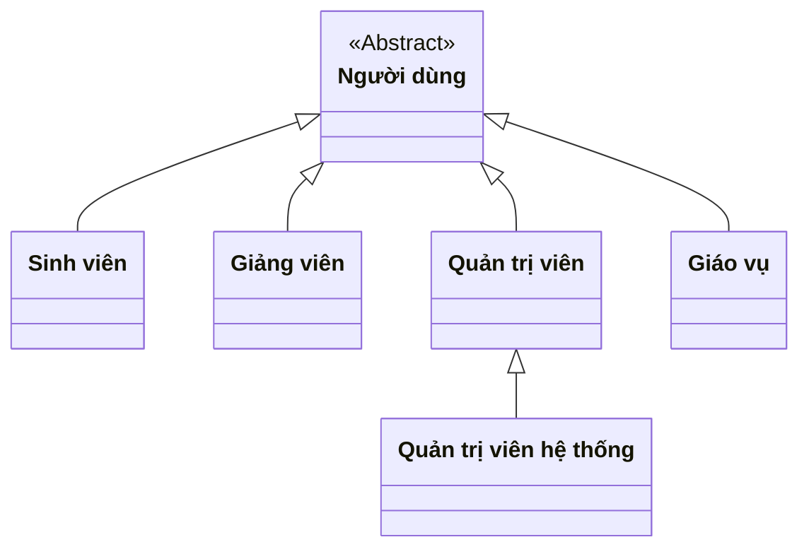
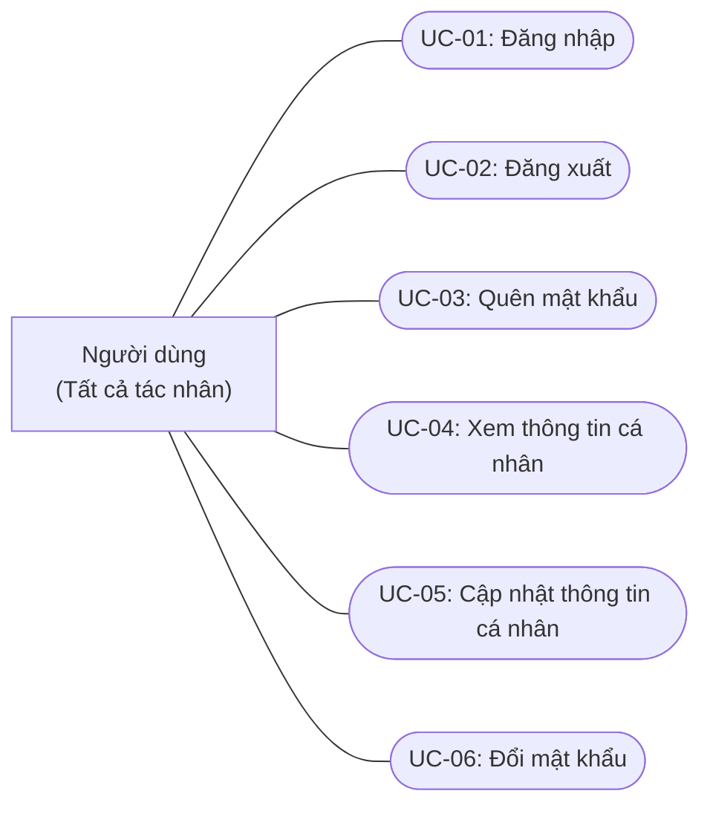
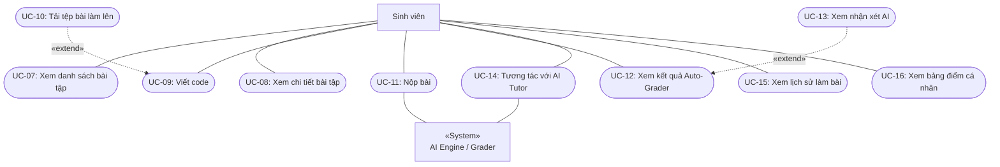
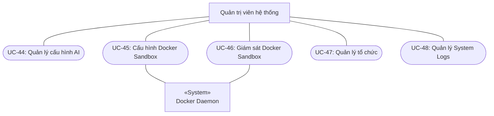

# SƠ ĐỒ USE CASE HỆ THỐNG AI CODING TUTOR (CHUẨN HÓA UML)

Tài liệu này cung cấp sơ đồ Use Case phân rã theo các phân hệ chức năng, được thiết kế theo đúng quy ước chuẩn **UML 2.5** nhằm khắc phục hoàn toàn các lỗi sai về chiều mũi tên `<<extend>>`, quan hệ `<<include>>`, và thiếu liên kết Actor. Cập nhật theo logic mới nhất với 48 Use Case và 5 nhóm tác nhân.

---

## 1. Phân cấp Tác nhân (Actor Hierarchy)

Hệ thống AI Coding Tutor gồm 5 nhóm tác nhân chính với mối quan hệ kế thừa/phân quyền:

---

## 2. Sơ đồ Use Case Tổng quan & Phân hệ chung: Xác thực & Hồ sơ cá nhân

Áp dụng cho tất cả người dùng.

---

## 3. Phân hệ Dành cho Sinh viên (Student Subsystem)

---

## 4. Phân hệ Dành cho Giảng viên (Teacher Subsystem)

```mermaid
flowchart TB
    %% Actors
    Teacher["Giảng viên"]

    %% Lớp học
    UC17(["UC-17: Tạo lớp học"])
    UC18(["UC-18: Chỉnh sửa lớp học"])
    UC20(["UC-20: Quản lý sinh viên trong lớp"])
    UC40(["UC-40: Đóng/Mở lại lớp học"])

    %% Bài tập
    UC21(["UC-21: Quản lý bài tập"])
    UC22(["UC-22: Chỉnh sửa thông tin bài tập"])
    UC23(["UC-23: Xóa bài tập"])
    UC24(["UC-24: Thiết lập hạn nộp bài"])
    UC25(["UC-25: Thiết lập test case"])
    UC26(["UC-26: Thiết lập rubric"])
    UC27(["UC-27: Giao bài tập cho lớp"])

    %% Đánh giá & Chấm bài
    UC28(["UC-28: Xem bài nộp"])
    UC29(["UC-29: Xem điểm"])
    UC30(["UC-30: Xem AI đánh giá"])
    UC31(["UC-31: Đánh giá/chấm bài thủ công"])

    %% Associations
    Teacher --- UC17
    Teacher --- UC18
    Teacher --- UC20
    Teacher --- UC40
    Teacher --- UC21
    Teacher --- UC22
    Teacher --- UC23
    Teacher --- UC24
    Teacher --- UC25
    Teacher --- UC26
    Teacher --- UC27
    Teacher --- UC28
    Teacher --- UC29
    Teacher --- UC31

    %% Relationships
    UC30 -. "«extend»" .-> UC28
    UC31 -. "«include»" .-> UC28
```

---

## 5. Phân hệ Dành cho Quản trị viên & Giáo vụ

```mermaid
flowchart TB
    %% Actors
    Admin["Quản trị viên"]
    Staff["Giáo vụ"]

    %% Quản lý người dùng
    UC32(["UC-32: Tạo tài khoản"])
    UC33(["UC-33: Khóa/mở tài khoản"])
    UC34(["UC-34: Xóa tài khoản"])
    UC35(["UC-35: Phân quyền người dùng"])
    UC36(["UC-36: Đặt lại mật khẩu"])
    UC37(["UC-37: Nhập danh sách từ Excel/CSV"])

    %% Quản lý lớp học
    UC38(["UC-38: Tạo lớp"])
    UC39(["UC-39: Chỉnh sửa lớp"])
    UC40(["UC-40: Đóng/Mở lại lớp học"])
    UC41(["UC-41: Quản lý Lưu trữ & Xóa lớp học"])
    UC42(["UC-42: Quản lý sinh viên trong lớp"])
    UC43(["UC-43: Phân công Giáo viên vào lớp"])

    %% Associations
    Admin --- UC32
    Admin --- UC33
    Admin --- UC34
    Admin --- UC35
    Admin --- UC36
    Admin --- UC37
    Admin --- UC38
    Admin --- UC39
    Admin --- UC40
    Admin --- UC41
    Admin --- UC42
    Admin --- UC43

    Staff --- UC38
    Staff --- UC39
    Staff --- UC40
    Staff --- UC41
    Staff --- UC42
    Staff --- UC43
```

---

## 6. Phân hệ Dành cho Quản trị viên hệ thống (Super Admin Subsystem)

---

## 7. Toàn cảnh mã nguồn PlantUML (Dành cho việc render ra ảnh PNG/SVG/PDF)

```plantuml
@startuml AI_Coding_Tutor_UseCases
left to right direction
skinparam packageStyle rectangle
skinparam shadowing false
skinparam monochrome false

actor "Người dùng" as User <<Abstract>>
actor "Sinh viên" as Student
actor "Giảng viên" as Teacher
actor "Quản trị viên" as Admin
actor "Giáo vụ" as Staff
actor "Quản trị viên hệ thống" as SuperAdmin

User <|-- Student
User <|-- Teacher
User <|-- Admin
User <|-- Staff
Admin <|-- SuperAdmin

rectangle "Hệ thống AI Coding Tutor" {
  package "Xác thực & Hồ sơ" {
    usecase "UC-01: Đăng nhập" as UC01
    usecase "UC-02: Đăng xuất" as UC02
    usecase "UC-03: Quên mật khẩu" as UC03
    usecase "UC-04: Xem thông tin cá nhân" as UC04
    usecase "UC-05: Cập nhật thông tin cá nhân" as UC05
    usecase "UC-06: Đổi mật khẩu" as UC06
  }

  package "Phân hệ Sinh viên" {
    usecase "UC-07: Xem danh sách bài tập" as UC07
    usecase "UC-08: Xem chi tiết bài tập" as UC08
    usecase "UC-09: Viết code" as UC09
    usecase "UC-10: Tải tệp bài làm lên" as UC10
    usecase "UC-11: Nộp bài" as UC11
    usecase "UC-12: Xem kết quả Auto-Grader" as UC12
    usecase "UC-13: Xem nhận xét AI" as UC13
    usecase "UC-14: Tương tác với AI Tutor" as UC14
    usecase "UC-15: Xem lịch sử làm bài" as UC15
    usecase "UC-16: Xem bảng điểm cá nhân" as UC16
  }

  package "Phân hệ Giảng viên" {
    usecase "UC-17: Tạo lớp học" as UC17
    usecase "UC-18: Chỉnh sửa lớp học" as UC18
    usecase "UC-20: Quản lý sinh viên trong lớp" as UC20
    usecase "UC-40: Đóng/Mở lại lớp học" as UC40_T
    usecase "UC-21: Quản lý bài tập" as UC21
    usecase "UC-22: Chỉnh sửa bài tập" as UC22
    usecase "UC-23: Xóa bài tập" as UC23
    usecase "UC-24: Thiết lập hạn nộp bài" as UC24
    usecase "UC-25: Thiết lập test case" as UC25
    usecase "UC-26: Thiết lập rubric" as UC26
    usecase "UC-27: Giao bài tập cho lớp" as UC27
    usecase "UC-28: Xem bài nộp" as UC28
    usecase "UC-29: Xem điểm" as UC29
    usecase "UC-30: Xem AI đánh giá" as UC30
    usecase "UC-31: Đánh giá/chấm bài thủ công" as UC31
  }

  package "Phân hệ Quản trị viên & Giáo vụ" {
    usecase "UC-32: Tạo tài khoản" as UC32
    usecase "UC-33: Khóa/mở tài khoản" as UC33
    usecase "UC-34: Xóa tài khoản" as UC34
    usecase "UC-35: Phân quyền người dùng" as UC35
    usecase "UC-36: Đặt lại mật khẩu" as UC36
    usecase "UC-37: Nhập danh sách từ Excel/CSV" as UC37
    usecase "UC-38: Tạo lớp" as UC38
    usecase "UC-39: Chỉnh sửa lớp" as UC39
    usecase "UC-40: Đóng/Mở lại lớp học" as UC40_A
    usecase "UC-41: Quản lý Lưu trữ & Xóa lớp học" as UC41
    usecase "UC-42: Quản lý sinh viên trong lớp" as UC42
    usecase "UC-43: Phân công Giáo viên vào lớp" as UC43
  }

  package "Phân hệ Quản trị viên hệ thống" {
    usecase "UC-44: Quản lý cấu hình AI" as UC44
    usecase "UC-45: Cấu hình Docker Sandbox" as UC45
    usecase "UC-46: Giám sát Docker Sandbox" as UC46
    usecase "UC-47: Quản lý tổ chức" as UC47
    usecase "UC-48: Quản lý System Logs" as UC48
  }
}

' Common Links
User --> UC01
User --> UC02
User --> UC03
User --> UC04
User --> UC05
User --> UC06

' Student Links
Student --> UC07
Student --> UC08
Student --> UC09
Student --> UC11
Student --> UC12
Student --> UC14
Student --> UC15
Student --> UC16

UC10 ..> UC09 : <<extend>>
UC13 ..> UC12 : <<extend>>

' Teacher Links
Teacher --> UC17
Teacher --> UC18
Teacher --> UC20
Teacher --> UC40_T
Teacher --> UC21
Teacher --> UC22
Teacher --> UC23
Teacher --> UC24
Teacher --> UC25
Teacher --> UC26
Teacher --> UC27
Teacher --> UC28
Teacher --> UC29
Teacher --> UC31

UC30 ..> UC28 : <<extend>>
UC31 ..> UC28 : <<include>>

' Admin & Staff Links
Admin --> UC32
Admin --> UC33
Admin --> UC34
Admin --> UC35
Admin --> UC36
Admin --> UC37
Admin --> UC38
Admin --> UC39
Admin --> UC40_A
Admin --> UC41
Admin --> UC42
Admin --> UC43

Staff --> UC38
Staff --> UC39
Staff --> UC40_A
Staff --> UC41
Staff --> UC42
Staff --> UC43

' Super Admin Links
SuperAdmin --> UC44
SuperAdmin --> UC45
SuperAdmin --> UC46
SuperAdmin --> UC47
SuperAdmin --> UC48

@enduml
```

