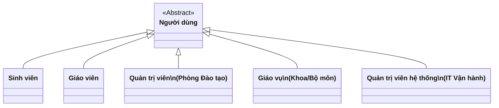
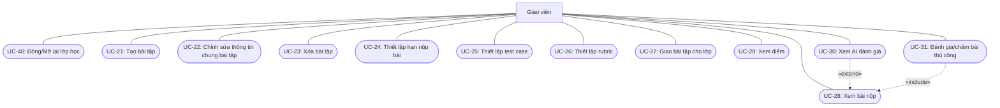

# SƠ ĐỒ USE CASE HỆ THỐNG AI CODING TUTOR (CHUẨN HÓA UML)

Tài liệu này cung cấp sơ đồ Use Case phân rã theo các phân hệ chức năng, được thiết kế theo đúng quy ước chuẩn **UML 2.5** với toàn bộ tên tác nhân bằng Tiếng Việt và hoàn toàn đồng bộ với **MASTER RULES**.

---

## 1. Phân cấp Tác nhân (Actor Hierarchy)

Hệ thống AI Coding Tutor gồm 5 nhóm tác nhân chính:

---

## 2. Sơ đồ Use Case Tổng quan & Phân hệ chung: Xác thực & Hồ sơ cá nhân

Áp dụng cho tất cả người dùng.

---

## 3. Phân hệ Dành cho Sinh viên (Student Subsystem)

---

## 4. Phân hệ Dành cho Giáo viên (Teacher Subsystem)

> *Ghi chú:* Các UC-17, UC-18, UC-20 đã được hủy bỏ ở cấp Giáo viên và chuyển sang quản lý tập trung tại cấp Quản trị viên / Giáo vụ (UC-38, UC-39, UC-42).

---

## 5. Phân hệ Dành cho Quản trị viên & Giáo vụ

```mermaid
flowchart TB
    %% Actors
    QuanTriVien["Quản trị viên\n(Phòng Đào tạo)"]
    GiaoVu["Giáo vụ\n(Khoa/Bộ môn)"]

    %% Quản lý người dùng
    UC32(["UC-32: Tạo tài khoản người dùng"])
    UC33(["UC-33: Khóa/mở tài khoản"])
    UC34(["UC-34: Xóa tài khoản"])
    UC35(["UC-35: Phân quyền người dùng"])
    UC36(["UC-36: Đặt lại mật khẩu"])
    UC37(["UC-37: Nhập danh sách từ Excel/CSV"])

    %% Quản lý lớp học & Tổ chức
    UC38(["UC-38: Tạo lớp"])
    UC39(["UC-39: Chỉnh sửa lớp"])
    UC40(["UC-40: Đóng/Mở lại lớp học"])
    UC41(["UC-41: Quản lý Lưu trữ & Xóa lớp học"])
    UC42(["UC-42: Quản lý sinh viên trong lớp"])
    UC43(["UC-43: Phân công Giáo viên vào lớp"])
    UC47(["UC-47: Quản lý tổ chức"])

    %% Associations Quản trị viên (Toàn trường)
    QuanTriVien --- UC32
    QuanTriVien --- UC33
    QuanTriVien --- UC34
    QuanTriVien --- UC35
    QuanTriVien --- UC36
    QuanTriVien --- UC37
    QuanTriVien --- UC38
    QuanTriVien --- UC39
    QuanTriVien --- UC40
    QuanTriVien --- UC41
    QuanTriVien --- UC42
    QuanTriVien --- UC43
    QuanTriVien --- UC47

    %% Associations Giáo vụ (Khoa/Bộ môn phụ trách)
    GiaoVu --- UC38
    GiaoVu --- UC39
    GiaoVu --- UC40
    GiaoVu --- UC41
    GiaoVu --- UC42
    GiaoVu --- UC43
```

---

## 6. Phân hệ Dành cho Quản trị viên hệ thống (Super Admin Subsystem)

---

## 7. Toàn cảnh mã nguồn PlantUML

```plantuml
@startuml AI_Coding_Tutor_UseCases
left to right direction
skinparam packageStyle rectangle
skinparam shadowing false
skinparam monochrome false

actor "Người dùng" as NguoiDung <<Abstract>>
actor "Sinh viên" as SinhVien
actor "Giáo viên" as GiaoVien
actor "Quản trị viên" as QuanTriVien
actor "Giáo vụ" as GiaoVu
actor "Quản trị viên hệ thống" as QuanTriVienHeThong

NguoiDung <|-- SinhVien
NguoiDung <|-- GiaoVien
NguoiDung <|-- QuanTriVien
NguoiDung <|-- GiaoVu
NguoiDung <|-- QuanTriVienHeThong

rectangle "Hệ thống AI Coding Tutor" {
  package "Xác thực & Hồ sơ" {
    usecase "UC-01: Đăng nhập" as UC01
    usecase "UC-02: Đăng xuất" as UC02
    usecase "UC-03: Quên mật khẩu" as UC03
    usecase "UC-04: Xem thông tin cá nhân" as UC04
    usecase "UC-05: Cập nhật thông tin cá nhân" as UC05
    usecase "UC-06: Đổi mật khẩu" as UC06
  }

  package "Phân hệ Sinh viên" {
    usecase "UC-07: Xem danh sách bài tập" as UC07
    usecase "UC-08: Xem chi tiết bài tập" as UC08
    usecase "UC-09: Viết code" as UC09
    usecase "UC-10: Upload file bài làm" as UC10
    usecase "UC-11: Nộp bài" as UC11
    usecase "UC-12: Xem kết quả Auto-Grader" as UC12
    usecase "UC-13: Xem nhận xét AI" as UC13
    usecase "UC-14: Tương tác với AI Tutor" as UC14
    usecase "UC-15: Xem bài đã nộp" as UC15
    usecase "UC-16: Xem bảng điểm cá nhân" as UC16
  }

  package "Phân hệ Giáo viên" {
    usecase "UC-40: Đóng/Mở lại lớp học" as UC40_T
    usecase "UC-21: Tạo bài tập" as UC21
    usecase "UC-22: Chỉnh sửa thông tin chung bài tập" as UC22
    usecase "UC-23: Xóa bài tập" as UC23
    usecase "UC-24: Thiết lập hạn nộp bài" as UC24
    usecase "UC-25: Thiết lập test case" as UC25
    usecase "UC-26: Thiết lập rubric" as UC26
    usecase "UC-27: Giao bài tập cho lớp" as UC27
    usecase "UC-28: Xem bài nộp" as UC28
    usecase "UC-29: Xem điểm" as UC29
    usecase "UC-30: Xem AI đánh giá" as UC30
    usecase "UC-31: Đánh giá/chấm bài thủ công" as UC31
  }

  package "Phân hệ Quản trị viên & Giáo vụ" {
    usecase "UC-32: Tạo tài khoản người dùng" as UC32
    usecase "UC-33: Khóa/mở tài khoản" as UC33
    usecase "UC-34: Xóa tài khoản" as UC34
    usecase "UC-35: Phân quyền người dùng" as UC35
    usecase "UC-36: Đặt lại mật khẩu" as UC36
    usecase "UC-37: Nhập danh sách từ Excel/CSV" as UC37
    usecase "UC-38: Tạo lớp" as UC38
    usecase "UC-39: Chỉnh sửa lớp" as UC39
    usecase "UC-40: Đóng/Mở lại lớp học" as UC40_A
    usecase "UC-41: Quản lý Lưu trữ & Xóa lớp học" as UC41
    usecase "UC-42: Quản lý sinh viên trong lớp" as UC42
    usecase "UC-43: Phân công Giáo viên vào lớp" as UC43
    usecase "UC-47: Quản lý tổ chức" as UC47
  }

  package "Phân hệ Quản trị viên hệ thống" {
    usecase "UC-44: Quản lý cấu hình AI" as UC44
    usecase "UC-45: Cấu hình Docker Sandbox" as UC45
    usecase "UC-46: Giám sát Docker Sandbox" as UC46
    usecase "UC-48: Quản lý System Logs" as UC48
  }
}

' Common Links
NguoiDung --> UC01
NguoiDung --> UC02
NguoiDung --> UC03
NguoiDung --> UC04
NguoiDung --> UC05
NguoiDung --> UC06

' Student Links
SinhVien --> UC07
SinhVien --> UC08
SinhVien --> UC09
SinhVien --> UC10
SinhVien --> UC11
SinhVien --> UC12
SinhVien --> UC13
SinhVien --> UC14
SinhVien --> UC15
SinhVien --> UC16

UC10 ..> UC09 : <<extend>>
UC13 ..> UC12 : <<extend>>

' Teacher Links
GiaoVien --> UC40_T
GiaoVien --> UC21
GiaoVien --> UC22
GiaoVien --> UC23
GiaoVien --> UC24
GiaoVien --> UC25
GiaoVien --> UC26
GiaoVien --> UC27
GiaoVien --> UC28
GiaoVien --> UC29
GiaoVien --> UC30
GiaoVien --> UC31

UC30 ..> UC28 : <<extend>>
UC31 ..> UC28 : <<include>>

' Admin & Staff Links
QuanTriVien --> UC32
QuanTriVien --> UC33
QuanTriVien --> UC34
QuanTriVien --> UC35
QuanTriVien --> UC36
QuanTriVien --> UC37
QuanTriVien --> UC38
QuanTriVien --> UC39
QuanTriVien --> UC40_A
QuanTriVien --> UC41
QuanTriVien --> UC42
QuanTriVien --> UC43
QuanTriVien --> UC47

GiaoVu --> UC38
GiaoVu --> UC39
GiaoVu --> UC40_A
GiaoVu --> UC41
GiaoVu --> UC42
GiaoVu --> UC43

' Super Admin Links
QuanTriVienHeThong --> UC35
QuanTriVienHeThong --> UC44
QuanTriVienHeThong --> UC45
QuanTriVienHeThong --> UC46
QuanTriVienHeThong --> UC48

@enduml
```

