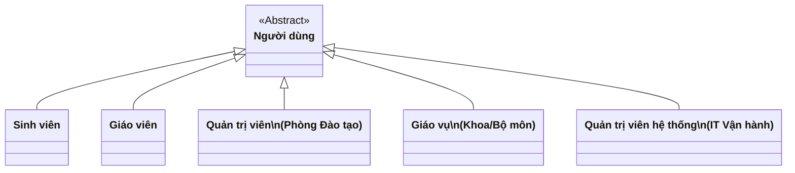
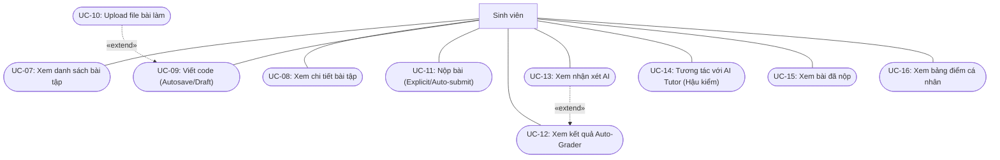
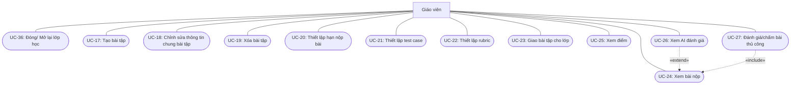
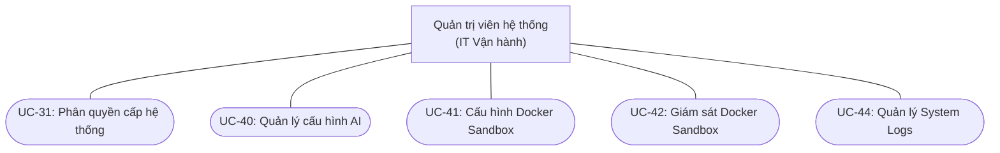

# SƠ ĐỒ USE CASE HỆ THỐNG AI CODING TUTOR (CHUẨN HÓA UML)

Tài liệu này cung cấp sơ đồ Use Case phân rã theo các phân hệ chức năng, được thiết kế theo đúng quy ước chuẩn **UML 2.5** với toàn bộ tên tác nhân bằng Tiếng Việt và hoàn toàn đồng bộ với đặc tả chuẩn [DOAN4.md](file:///d:/GITHUB/ai-coding-tutor/DOAN4.md) (44 Use Cases).

---

## 1. Phân cấp Tác nhân (Actor Hierarchy)

Hệ thống AI Coding Tutor gồm 5 nhóm tác nhân chính:

---

## 2. Sơ đồ Use Case Tổng quan & Phân hệ chung: Xác thực & Hồ sơ cá nhân (UC-01..06)

Áp dụng cho tất cả người dùng.

---

## 3. Phân hệ Dành cho Sinh viên (Student Subsystem: UC-07..16)

---

## 4. Phân hệ Dành cho Giáo viên (Teacher Subsystem: UC-17..27, UC-36)

---

## 5. Phân hệ Dành cho Quản trị viên & Giáo vụ (Admin & Staff Subsystem: UC-28..39, UC-43)

```mermaid
flowchart TB
    %% Actors
    QuanTriVien["Quản trị viên\n(Phòng Đào tạo)"]
    GiaoVu["Giáo vụ\n(Khoa/Bộ môn)"]

    %% Quản lý người dùng
    UC28(["UC-28: Tạo tài khoản người dùng"])
    UC29(["UC-29: Khóa/mở tài khoản"])
    UC30(["UC-30: Xóa tài khoản"])
    UC31(["UC-31: Phân quyền người dùng"])
    UC32(["UC-32: Đặt lại mật khẩu"])
    UC33(["UC-33: Nhập danh sách từ Excel/CSV"])

    %% Quản lý lớp học & Tổ chức
    UC34(["UC-34: Tạo lớp"])
    UC35(["UC-35: Chỉnh sửa lớp"])
    UC36(["UC-36: Đóng/ Mở lại lớp học"])
    UC37(["UC-37: Quản lý Lưu trữ, Khôi phục & Xóa lớp học"])
    UC38(["UC-38: Quản lý sinh viên trong lớp"])
    UC39(["UC-39: Phân công Giáo viên vào lớp"])
    UC43(["UC-43: Quản lý tổ chức, Khoa/Bộ môn & Phân công Giáo vụ"])

    %% Associations Quản trị viên (Toàn trường)
    QuanTriVien --- UC28
    QuanTriVien --- UC29
    QuanTriVien --- UC30
    QuanTriVien --- UC31
    QuanTriVien --- UC32
    QuanTriVien --- UC33
    QuanTriVien --- UC34
    QuanTriVien --- UC35
    QuanTriVien --- UC36
    QuanTriVien --- UC37
    QuanTriVien --- UC38
    QuanTriVien --- UC39
    QuanTriVien --- UC43

    %% Associations Giáo vụ (Khoa/Bộ môn phụ trách)
    GiaoVu --- UC34
    GiaoVu --- UC35
    GiaoVu --- UC36
    GiaoVu --- UC37
    GiaoVu --- UC38
    GiaoVu --- UC39
```

---

## 6. Phân hệ Dành cho Quản trị viên hệ thống (Technical Admin Subsystem: UC-40..42, UC-44, UC-31)

---

## 7. Toàn cảnh mã nguồn PlantUML

```plantuml
@startuml AI_Coding_Tutor_UseCases
left to right direction
skinparam packageStyle rectangle
skinparam shadowing false
skinparam monochrome false

actor "Người dùng" as NguoiDung <<Abstract>>
actor "Sinh viên" as SinhVien
actor "Giáo viên" as GiaoVien
actor "Quản trị viên" as QuanTriVien
actor "Giáo vụ" as GiaoVu
actor "Quản trị viên hệ thống" as QuanTriVienHeThong

NguoiDung <|-- SinhVien
NguoiDung <|-- GiaoVien
NguoiDung <|-- QuanTriVien
NguoiDung <|-- GiaoVu
NguoiDung <|-- QuanTriVienHeThong

rectangle "Hệ thống AI Coding Tutor (44 Use Cases)" {
  package "Xác thực & Hồ sơ cá nhân" {
    usecase "UC-01: Đăng nhập" as UC01
    usecase "UC-02: Đăng xuất" as UC02
    usecase "UC-03: Quên mật khẩu" as UC03
    usecase "UC-04: Xem thông tin cá nhân" as UC04
    usecase "UC-05: Cập nhật thông tin cá nhân" as UC05
    usecase "UC-06: Đổi mật khẩu" as UC06
  }

  package "Phân hệ Sinh viên" {
    usecase "UC-07: Xem danh sách bài tập" as UC07
    usecase "UC-08: Xem chi tiết bài tập" as UC08
    usecase "UC-09: Viết code" as UC09
    usecase "UC-10: Upload file bài làm" as UC10
    usecase "UC-11: Nộp bài" as UC11
    usecase "UC-12: Xem kết quả Auto-Grader" as UC12
    usecase "UC-13: Xem nhận xét AI" as UC13
    usecase "UC-14: Tương tác với AI Tutor" as UC14
    usecase "UC-15: Xem bài đã nộp" as UC15
    usecase "UC-16: Xem bảng điểm cá nhân" as UC16
  }

  package "Phân hệ Giáo viên" {
    usecase "UC-17: Tạo bài tập" as UC17
    usecase "UC-18: Chỉnh sửa thông tin chung bài tập" as UC18
    usecase "UC-19: Xóa bài tập" as UC19
    usecase "UC-20: Thiết lập hạn nộp bài" as UC20
    usecase "UC-21: Thiết lập test case" as UC21
    usecase "UC-22: Thiết lập rubric" as UC22
    usecase "UC-23: Giao bài tập cho lớp" as UC23
    usecase "UC-24: Xem bài nộp" as UC24
    usecase "UC-25: Xem điểm" as UC25
    usecase "UC-26: Xem AI đánh giá" as UC26
    usecase "UC-27: Đánh giá/chấm bài thủ công" as UC27
    usecase "UC-36: Đóng/ Mở lại lớp học" as UC36_T
  }

  package "Phân hệ Quản trị viên & Giáo vụ" {
    usecase "UC-28: Tạo tài khoản người dùng" as UC28
    usecase "UC-29: Khóa/mở tài khoản" as UC29
    usecase "UC-30: Xóa tài khoản" as UC30
    usecase "UC-31: Phân quyền người dùng" as UC31
    usecase "UC-32: Đặt lại mật khẩu" as UC32
    usecase "UC-33: Nhập danh sách từ Excel/CSV" as UC33
    usecase "UC-34: Tạo lớp" as UC34
    usecase "UC-35: Chỉnh sửa lớp" as UC35
    usecase "UC-36: Đóng/ Mở lại lớp học" as UC36_A
    usecase "UC-37: Quản lý Lưu trữ, Khôi phục & Xóa lớp học" as UC37
    usecase "UC-38: Quản lý sinh viên trong lớp" as UC38
    usecase "UC-39: Phân công Giáo viên vào lớp" as UC39
    usecase "UC-43: Quản lý tổ chức, Khoa/Bộ môn & Phân công Giáo vụ" as UC43
  }

  package "Phân hệ Quản trị viên hệ thống" {
    usecase "UC-40: Quản lý cấu hình AI" as UC40
    usecase "UC-41: Cấu hình Docker Sandbox" as UC41
    usecase "UC-42: Giám sát Docker Sandbox" as UC42
    usecase "UC-44: Quản lý System Logs" as UC44
  }
}

' Common Links
NguoiDung --> UC01
NguoiDung --> UC02
NguoiDung --> UC03
NguoiDung --> UC04
NguoiDung --> UC05
NguoiDung --> UC06

' Student Links
SinhVien --> UC07
SinhVien --> UC08
SinhVien --> UC09
SinhVien --> UC10
SinhVien --> UC11
SinhVien --> UC12
SinhVien --> UC13
SinhVien --> UC14
SinhVien --> UC15
SinhVien --> UC16

UC10 ..> UC09 : <<extend>>
UC13 ..> UC12 : <<extend>>

' Teacher Links
GiaoVien --> UC36_T
GiaoVien --> UC17
GiaoVien --> UC18
GiaoVien --> UC19
GiaoVien --> UC20
GiaoVien --> UC21
GiaoVien --> UC22
GiaoVien --> UC23
GiaoVien --> UC24
GiaoVien --> UC25
GiaoVien --> UC26
GiaoVien --> UC27

UC26 ..> UC24 : <<extend>>
UC27 ..> UC24 : <<include>>

' Admin & Staff Links
QuanTriVien --> UC28
QuanTriVien --> UC29
QuanTriVien --> UC30
QuanTriVien --> UC31
QuanTriVien --> UC32
QuanTriVien --> UC33
QuanTriVien --> UC34
QuanTriVien --> UC35
QuanTriVien --> UC36_A
QuanTriVien --> UC37
QuanTriVien --> UC38
QuanTriVien --> UC39
QuanTriVien --> UC43

GiaoVu --> UC34
GiaoVu --> UC35
GiaoVu --> UC36_A
GiaoVu --> UC37
GiaoVu --> UC38
GiaoVu --> UC39

' Super Admin Links
QuanTriVienHeThong --> UC31
QuanTriVienHeThong --> UC40
QuanTriVienHeThong --> UC41
QuanTriVienHeThong --> UC42
QuanTriVienHeThong --> UC44

@enduml
```

